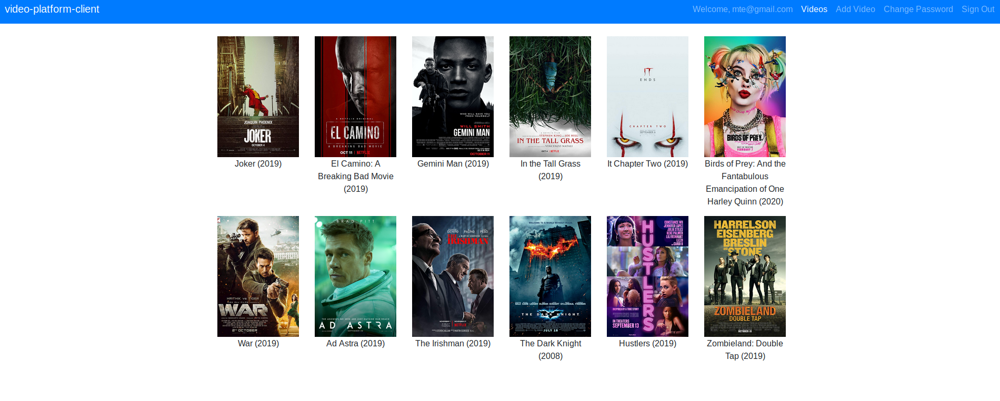
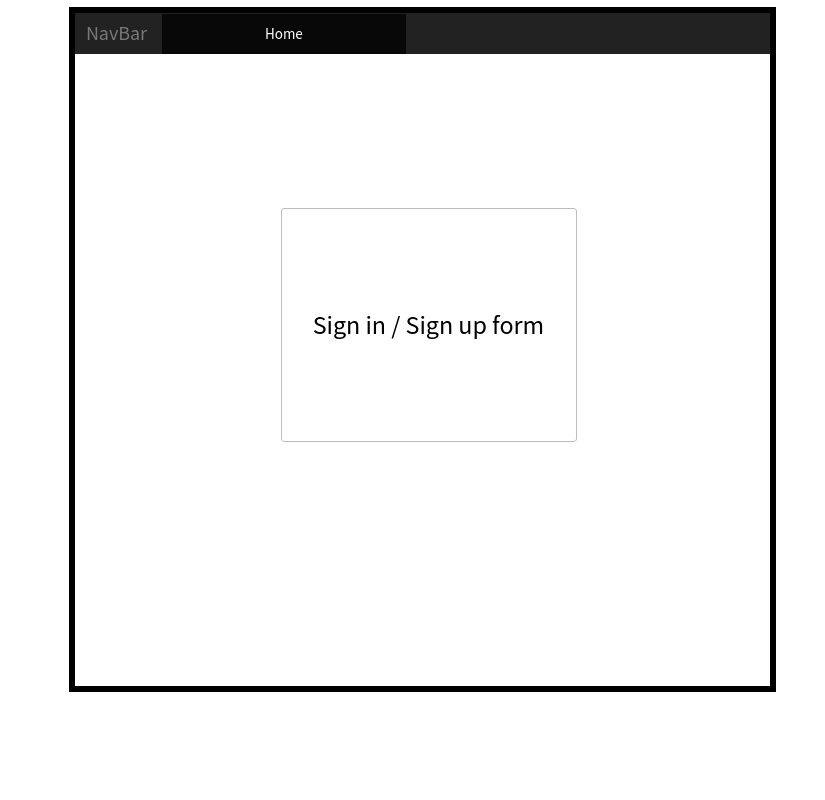
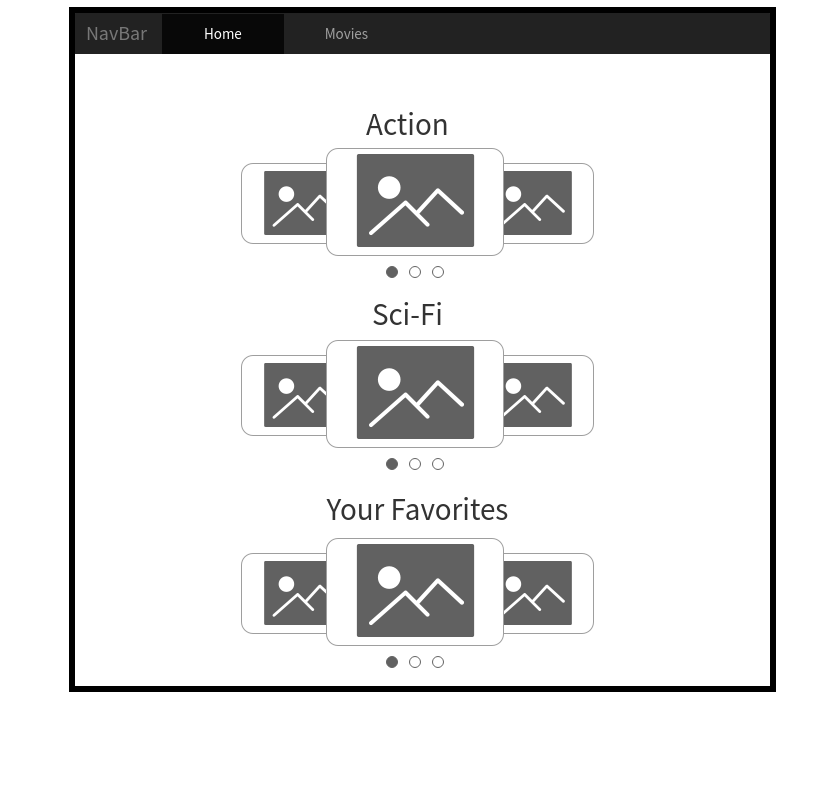
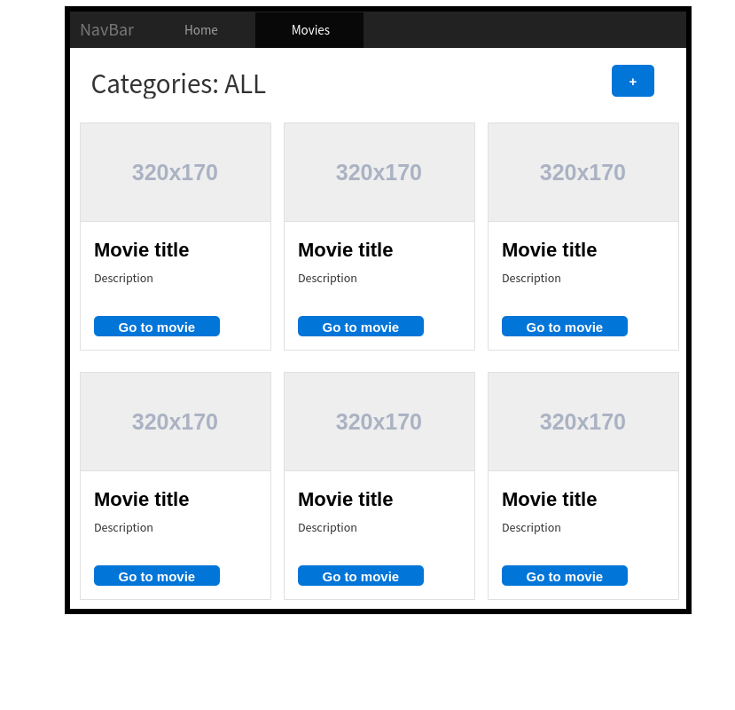

# Video Platform - Front-end Client

## App Summary
The app is a video platform that provides the base structure to flesh out a more comprehensive app. It is a project that will be continuously revisited to have more things added with new developments as I learn and grow as a developer.

Currently it is a user driven site where a show/movie is posted with title, year, description, trailer URL from YouTube, a poster image and categories of genre the video belongs to. The index page shows you the list of videos that have been added and clicking one will bring you to the page with the previously mentioned information.

### Setup and local installation
1. Clone repository
2. `npm install` for dependencies
3. Use links below to go to API repository, clone and install that
4. `npm start` to run a localhost

Make sure to change your `apiUrl` in `/src/apiConfig.js` if the intention is not running a localhost.

## Links
**Deployed front-end client:** https://marcpelve.github.io/video-platform-client

**Front-end client repository:** https://github.com/marcpelve/video-platform-client

**Deployed back-end API:** https://shielded-mountain-36338.herokuapp.com

**Back-end API repository:** https://github.com/marcpelve/video-platform-api

## Technologies
HTML5, CSS3, SASS, React-Bootstrap

JavaScript ES6, React, axios for AJAX

## Development documentation

### Wireframes && User stories

Wireframes

User stories

- As a user I want to sign up if I don't have an account.
- As a user I want to sign in if I have an account.

- As a user I want to browse through the list of movies.
- As a user I want to add movies to my favorites.
- As a user I want to add movies to the database of movies.
- As a user I want to have movies sorted by categories.
- As a user I want to edit a movie's listing.
- As a user I want to delete a movie's listing.

### Client - Front-end
##### Setup and intialize to local/remote and Git Pages
Install dependencies and work with locally with Grunt
- Use `npm` to install dependencies
- Use `npm` to deploy to Gh Pages

##### Structure planning - Linking to API
Link to API resource and use for protected transactions
- `User` resource requests for authentication
- `Video` resource to be used as videos listing
  - Open resource behind protected route, will require authorization token to access page

  <table style="display:inline">
  <th colspan="2" style="text-align:center">Videos</th>
  <th colspan="2" style="text-align:center">User</th>
  <tr>
  <td>_id</td>
  <td>MongoDB ObjectId</td>
  <td>id</td>
  <td>MongoDB ObjectId</td>
  </tr>
  <tr>
  <td>title</td>
  <td>string</td>
  <td>email</td>
  <td>string</td>
  </tr>
  <tr>
  <td>year</td>
  <td>number</td>
  <td>password</td>
  <td>string</td>
  </tr>
  <tr>
  <td>description</td>
  <td>string</td>
  <td>password_confirmation</td>
  <td>string</td>
  </tr>
  <tr>
  <td>videoUrl</td>
  <td>string</td>
  <td>favorites</td>
  <td>[ ref: Video ]</td>
  </tr>
  <tr>
  <td>imageUrl</td>
  <td>string</td>
  <td></td>
  <td></td>
  </tr>
  <tr>
  <td>category</td>
  <td>[ string ] : enum</td>
  <td></td>
  <td></td>
  </tr>
  <tr>
  <td>timestamps</td>
  <td>Mongoose default</td>
  <td>timestamps</td>
  <td>Mongoose default</td>
  </tr>
  </table>

##### Data Display
Built with React

Created React components and various routes to display the data.
- Videos listing page at `#/videos`
- Video specific page at `#/videos/:id`
- Add video page at `#/create-video`
- Edit video page at `#/videos/:id/edit`

##### End Point Testing
Postman requests to test early in development

<ul style="list-style-type:none;">
  <li>get -> #index, #show</li>
  <li>post -> #create</li>
  <li>patch -> #update</li>
  <li>delete -> #destroy</li>
</ul>

### Project realizations
Coming into this project, relatively new to React, would mean that I would have a lot of learning to do in the process. This meant that features that I originally wanted to implement would have to be delayed for future iterations as its more important to create a minimum viable product that I can continually add to as my skills progress.

One of these early realizations was the classic Netflix show/movie slider that scroll left to right on your Netflix homepage. Tackling this made me realize that whilst it's something I'm definitely going to tackle in the future, it shouldn't be a priority as creating a product under time constraints would require a more focused approach. This realization gave me a good perspective on time management for pieces of functionality in a project.

#### Potential updates
1. Implement `user` favorites, resource is already set up for it
2. Create homepage with Netflix like slider sorted by category
3. Create search bar and link to API search action for better data display
3. Make requests to 3rd party API for more app functionality
